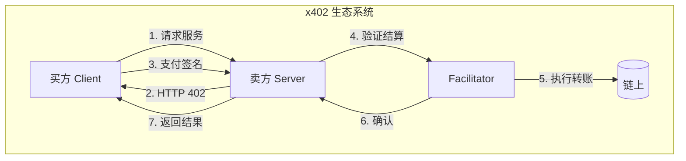
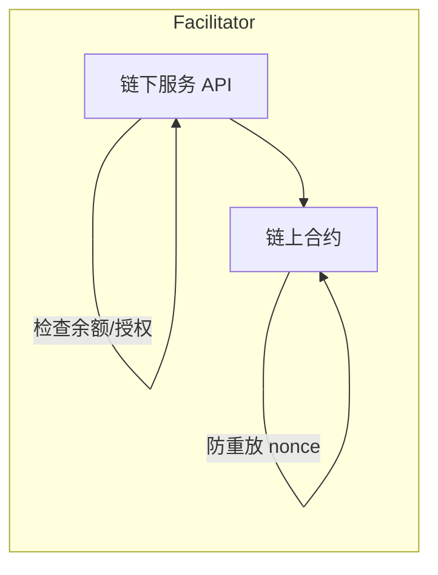
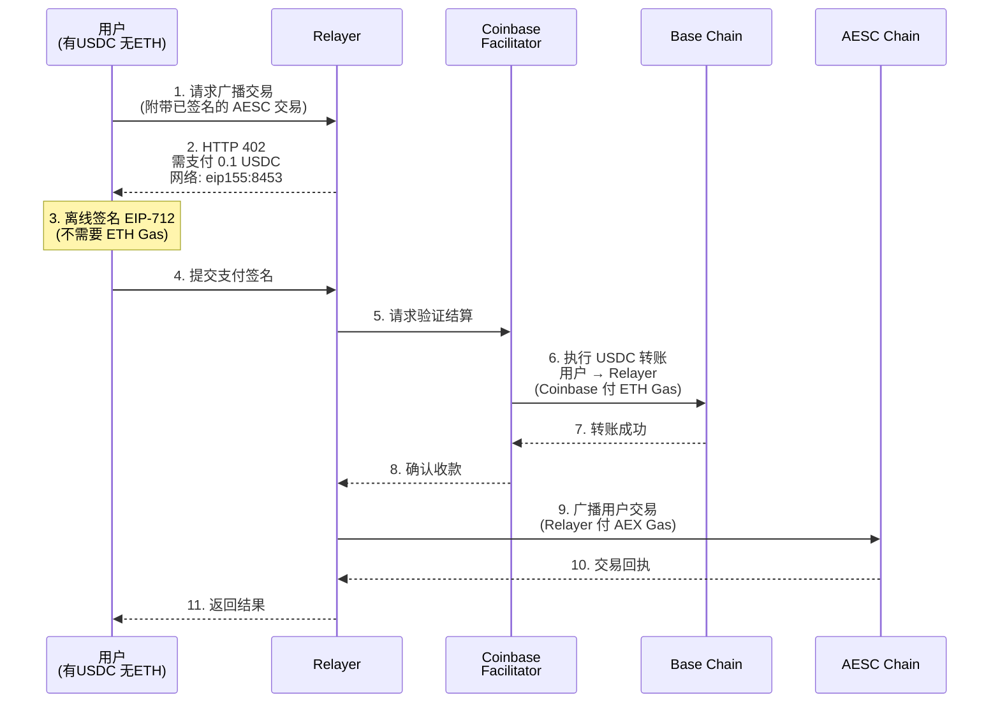
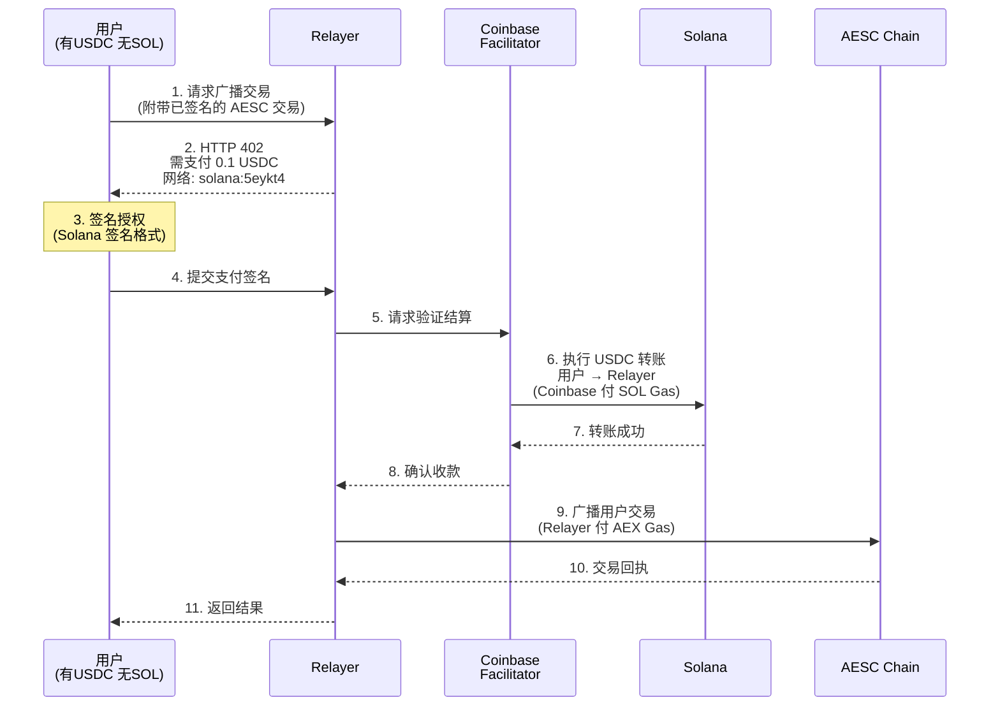
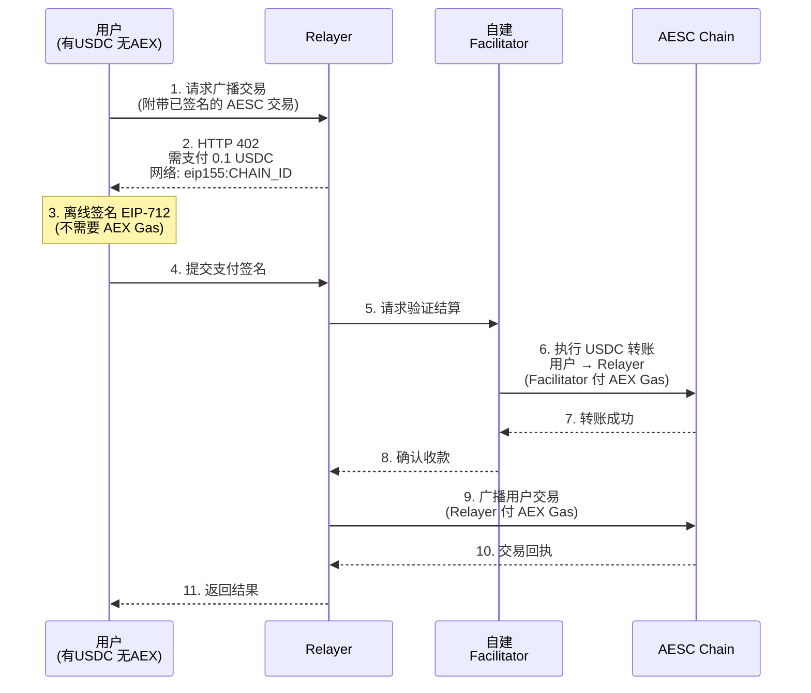
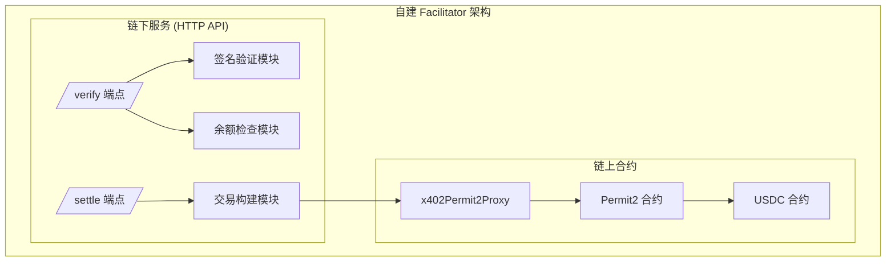
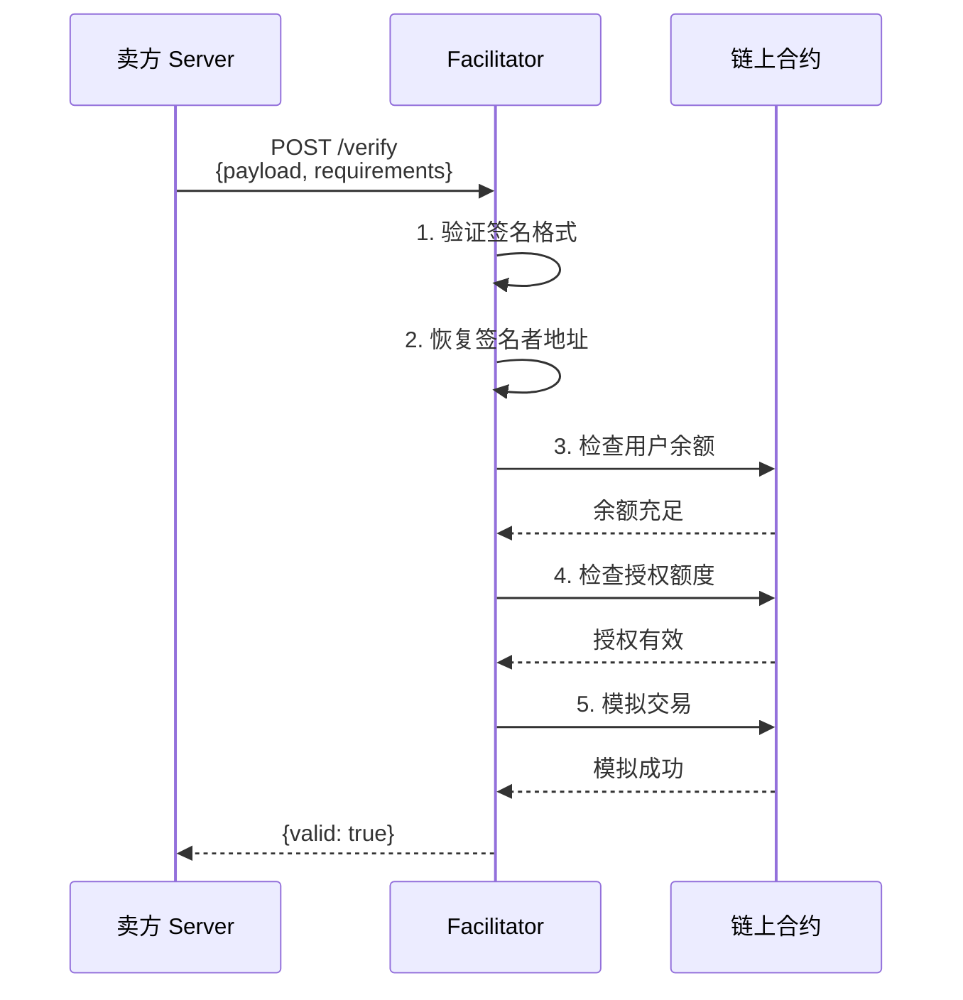
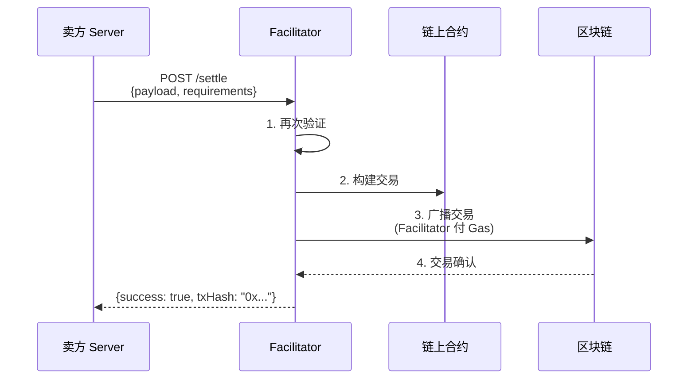
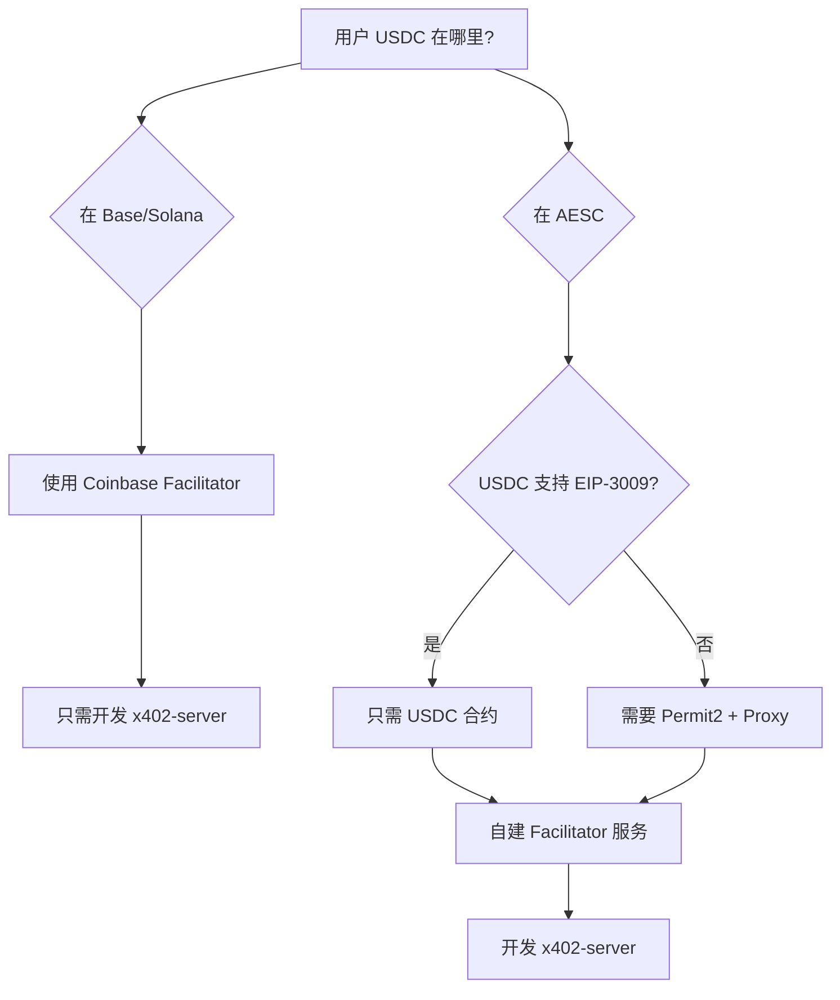

# x402 协议技术方案分析

## 一、x402 协议概述

x402 是 Coinbase 开发的开放支付协议，使用 HTTP 402 状态码实现即时稳定币支付。

### 核心特点

| 特点 | 说明 |
|------|------|
| 离线签名 | 用户只需签名 EIP-712 消息，不需要发送链上交易 |
| 无 Gas | 用户不需要持有原生代币（ETH/SOL/AEX） |
| 即时结算 | Facilitator 负责链上结算 |
| 标准化 | 基于 HTTP 402 状态码，易于集成 |

### 核心组件



| 角色 | 职责 |
|------|------|
| 买方 (Client) | 持有 USDC，无需 Gas，离线签名 |
| 卖方 (Server) | 提供服务，接收 USDC，调用结算 |
| Facilitator | 链下：验证签名；链上：执行转账；支付 Gas |

---

## 二、Facilitator 详解

### Facilitator 组成



| 组件 | 功能 |
|------|------|
| 链下服务 | 接收签名、验证参数、检查余额、调用合约 |
| 链上合约 | 验证签名、执行 USDC 转账、记录凭证、防重放 |

### Gas 费用承担

| 角色 | 支付 Gas？ | 说明 |
|------|-----------|------|
| 用户（买方） | ❌ | 只做离线签名 |
| 卖方 | 可选 | 可自己调用合约 |
| Facilitator 运营方 | ✅ | 通常由 Facilitator 承担 |

---

## 三、用户场景：交易中继服务

### 场景描述

- **用户现状**：持有 USDC，没有原生 Gas 代币，想在 AESC Chain 上发送交易
- **解决方案**：用户用 USDC 支付 Relayer 服务费，Relayer 帮用户广播交易

---

## 四、方案对比

### 场景 A：在 Base 上结算（Coinbase 官方 Facilitator）

**前提条件**：
- 用户在 Base 链上持有 USDC
- 使用 Coinbase 官方 Facilitator（免费，无需部署）
- Relayer 在 Base 上有地址接收 USDC
- Relayer 在 AESC 上有 AEX 支付 Gas



**优点**：
- ✅ 无需部署 Facilitator
- ✅ Coinbase 承担 Base 链上 Gas
- ✅ 成熟稳定

**缺点**：
- ⚠️ 用户 USDC 必须在 Base 链上
- ⚠️ 依赖 Coinbase 服务

---

### 场景 B：在 Solana 上结算（Coinbase 官方 Facilitator）

**前提条件**：
- 用户在 Solana 上持有 USDC
- 使用 Coinbase 官方 Facilitator
- Relayer 在 Solana 上有地址接收 USDC
- Relayer 在 AESC 上有 AEX 支付 Gas



**优点**：
- ✅ 无需部署 Facilitator
- ✅ Coinbase 承担 Solana 链上 Gas
- ✅ Solana 交易速度快、费用低

**缺点**：
- ⚠️ 用户 USDC 必须在 Solana 上
- ⚠️ 依赖 Coinbase 服务

---

### 场景 D：在 AESC Chain 上结算（自建 Facilitator）

**前提条件**：
- 用户在 AESC 上持有 USDC（桥接或原生）
- 需要部署 Facilitator 合约和服务到 AESC
- 需要 AEX 支付 Facilitator Gas



**需要自建的组件**：

| 组件 | 说明 |
|------|------|
| Facilitator 合约 | 部署到 AESC，处理 USDC 转账 |
| Facilitator 服务 | 验证签名，调用合约 |
| USDC 合约 | AESC 上的 USDC（桥接或原生部署） |
| AEX Gas | 运营方需要持有 AEX |

**优点**：
- ✅ 所有操作在同一条链上
- ✅ 无跨链延迟
- ✅ 完全自主可控

**缺点**：
- ⚠️ 需要自建 Facilitator（开发成本）
- ⚠️ AESC 上需要有 USDC 流动性
- ⚠️ 运营方需要持有 AEX 支付 Gas

---

## 五、方案对比总结

| 方案 | 结算链 | Facilitator | Gas 代币 | 复杂度 | 用户 USDC 位置 |
|------|--------|-------------|----------|--------|---------------|
| A | Base | Coinbase 官方 | ETH (Coinbase 付) | ⭐ 低 | Base |
| B | Solana | Coinbase 官方 | SOL (Coinbase 付) | ⭐ 低 | Solana |
| D | AESC | 自建 | AEX (自己付) | ⭐⭐⭐ 高 | AESC |

---

## 六、推荐策略

### 阶段一（快速上线）
- 采用 **方案 A（Base）** 或 **方案 B（Solana）**
- 使用 Coinbase 官方 Facilitator
- 无需开发 Facilitator 组件

### 阶段二（生态完善）
- 在 AESC 上部署 USDC（或桥接）
- 自建 Facilitator（参考 Coinbase 开源实现）
- 支持 **方案 D（AESC 原生结算）**

---

## 七、自建 Facilitator 指南

如果需要在 AESC Chain 或其他不被 Coinbase 官方支持的网络上运行 x402，需要自建 Facilitator。

### 7.1 Facilitator 架构概览



### 7.2 链上合约组件

#### 7.2.1 资产转移方式

x402 支持两种资产转移方式：

| 方式 | 适用场景 | 推荐度 |
|------|----------|--------|
| **EIP-3009** | USDC 等支持 `transferWithAuthorization` 的代币 | ⭐⭐⭐ 推荐（最简单） |
| **Permit2** | 任意 ERC-20 代币 | ⭐⭐ 通用方案 |

#### 7.2.2 EIP-3009 方式（推荐用于 USDC）

如果 AESC 上的 USDC 支持 EIP-3009，Facilitator 只需调用 USDC 合约的 `transferWithAuthorization` 方法：

```solidity
// USDC 合约已有此方法，无需额外部署合约
function transferWithAuthorization(
    address from,
    address to,
    uint256 value,
    uint256 validAfter,
    uint256 validBefore,
    bytes32 nonce,
    uint8 v,
    bytes32 r,
    bytes32 s
) external;
```

**优点**：
- 无需部署额外合约
- 用户签名直接授权转账
- 最简单的实现方式

#### 7.2.3 Permit2 方式（通用方案）

如果代币不支持 EIP-3009，需要部署 `x402Permit2Proxy` 合约：

```solidity
// SPDX-License-Identifier: MIT
pragma solidity ^0.8.0;

import {ISignatureTransfer} from "permit2/src/interfaces/ISignatureTransfer.sol";

contract x402Permit2Proxy {
    ISignatureTransfer public immutable PERMIT2;

    string public constant WITNESS_TYPE_STRING =
        "Witness witness)Witness(bytes extra,address to,uint256 validAfter)TokenPermissions(address token,uint256 amount)";

    bytes32 public constant WITNESS_TYPEHASH =
        keccak256("Witness(bytes extra,address to,uint256 validAfter)");

    struct Witness {
        address to;
        uint256 validAfter;
        bytes extra;
    }

    constructor(address _permit2) {
        PERMIT2 = ISignatureTransfer(_permit2);
    }

    function settle(
        ISignatureTransfer.PermitTransferFrom calldata permit,
        uint256 amount,
        address owner,
        Witness calldata witness,
        bytes calldata signature
    ) external {
        require(block.timestamp >= witness.validAfter, "Too early");
        require(amount <= permit.permitted.amount, "Amount exceeds permitted");

        ISignatureTransfer.SignatureTransferDetails memory transferDetails =
            ISignatureTransfer.SignatureTransferDetails({
                to: witness.to,
                requestedAmount: amount
            });

        bytes32 witnessHash = keccak256(abi.encode(
            WITNESS_TYPEHASH,
            keccak256(witness.extra),
            witness.to,
            witness.validAfter
        ));

        PERMIT2.permitWitnessTransferFrom(
            permit,
            transferDetails,
            owner,
            witnessHash,
            WITNESS_TYPE_STRING,
            signature
        );
    }
}
```

**前置条件**：
1. 需要在 AESC 上部署 Uniswap 的 Permit2 合约
2. 用户需要一次性授权 Permit2 合约（需要 AEX Gas）

### 7.3 链下服务组件

#### 7.3.1 API 端点

| 端点 | 方法 | 功能 |
|------|------|------|
| `/verify` | POST | 验证支付签名有效性 |
| `/settle` | POST | 执行链上结算 |

#### 7.3.2 验证流程 (`/verify`)



**验证检查项**：
1. 签名有效且恢复到正确地址
2. 用户余额 ≥ 支付金额
3. 授权额度足够（EIP-3009 无需检查）
4. 时间窗口有效（validAfter ≤ now ≤ validBefore）
5. Nonce 未被使用
6. 模拟交易成功

#### 7.3.3 结算流程 (`/settle`)



### 7.4 部署步骤

#### 步骤 1：部署链上合约

```bash
# 如果使用 Permit2 方式
# 1. 部署 Permit2 合约（或使用已有的）
# 2. 部署 x402Permit2Proxy 合约

# 如果 USDC 支持 EIP-3009
# 无需部署额外合约
```

#### 步骤 2：配置 Facilitator 服务

```yaml
# facilitator-config.yaml
network:
  chain_id: <AESC_CHAIN_ID>
  rpc_url: "https://rpc.aesc.example.com"

contracts:
  usdc: "0x..."           # USDC 合约地址
  permit2: "0x..."        # Permit2 合约地址（如使用）
  proxy: "0x..."          # x402Permit2Proxy 地址（如使用）

wallet:
  private_key: "${FACILITATOR_PRIVATE_KEY}"

gas:
  max_gas_price: "100 gwei"
  gas_limit: 200000
```

#### 步骤 3：启动服务

```bash
# 使用 x402 官方 Go SDK
go get github.com/coinbase/x402/go

# 或使用 TypeScript SDK
npm install @x402/core @x402/evm
```

### 7.5 运营考虑

#### 7.5.1 Gas 资金管理

| 项目 | 说明 |
|------|------|
| 初始资金 | Facilitator 钱包需要充足的 AEX |
| 监控告警 | 余额低于阈值时告警 |
| 自动补充 | 可设置自动从交易所提币 |

#### 7.5.2 安全考虑

| 风险 | 缓解措施 |
|------|----------|
| 私钥泄露 | 使用 HSM 或 KMS |
| 重放攻击 | Nonce 机制已内置 |
| 服务宕机 | 多节点部署 + 负载均衡 |
| 恶意请求 | 速率限制 + 请求验证 |

#### 7.5.3 费用模型

```
Facilitator 成本 = Gas 费用 + 运营成本
Facilitator 收入 = 服务费（可选）

建议：
- 初期免费运营，吸引用户
- 后期可收取小额服务费（如 0.1%）
```

### 7.6 参考实现

| 资源 | 链接 |
|------|------|
| x402 官方仓库 | https://github.com/coinbase/x402 |
| Go SDK | https://github.com/coinbase/x402/tree/main/go |
| TypeScript SDK | https://github.com/coinbase/x402/tree/main/typescript |
| EVM Scheme 规范 | https://github.com/coinbase/x402/blob/main/specs/schemes/exact/scheme_exact_evm.md |
| Permit2 合约 | https://docs.uniswap.org/contracts/v4/deployments |

---

## 八、完整组件清单

### 8.1 服务层

| 服务 | 职责 | 是否必须 |
|------|------|----------|
| **x402-server (Relayer)** | 接收用户交易请求，返回 402 支付要求，收款后广播交易 | ✅ 必须 |
| **Facilitator 服务** | 验证签名、检查余额、调用合约结算 | 🔶 可选（可用 Coinbase 官方） |

> **注意**：如果在 Base/Solana 上结算，Facilitator 服务可以使用 Coinbase 官方的，无需自建。

### 8.2 合约层

| 合约 | 说明 | 是否必须 |
|------|------|----------|
| **USDC 合约** | AESC 上需要有 USDC 代币 | ✅ 必须（如果在 AESC 结算） |
| **x402Permit2Proxy** | 验证签名并执行转账 | 🔶 仅 Permit2 方式需要 |
| **Permit2 合约** | Uniswap 的通用授权合约 | 🔶 仅 Permit2 方式需要 |

> **简化方案**：如果 USDC 支持 EIP-3009（`transferWithAuthorization`），则**不需要**部署 x402Permit2Proxy 和 Permit2，直接调用 USDC 合约即可。

### 8.3 基础设施

| 组件 | 说明 | 是否必须 |
|------|------|----------|
| **跨链桥** | 将 USDC 从其他链（Base/ETH）桥接到 AESC | 🔶 取决于 USDC 来源 |

---

## 九、方案选择决策树



---

## 十、分阶段实施计划

### 阶段 1：最小可行方案（MVP）

| 项目 | 说明 |
|------|------|
| 结算链 | Base |
| Facilitator | Coinbase 官方（免费） |
| 需要开发 | 仅 x402-server |
| 需要部署合约 | 无 |
| 跨链桥 | 无需 |

**优点**：开发成本最低，快速上线验证

### 阶段 2：AESC 原生结算

| 项目 | 说明 |
|------|------|
| 结算链 | AESC |
| Facilitator | 自建 |
| 需要开发 | x402-server + Facilitator 服务 |
| 需要部署合约 | USDC + (Permit2 + Proxy，视情况) |
| 跨链桥 | 需要（将 USDC 桥接到 AESC） |

**优点**：完全自主可控，无跨链延迟

### 各场景组件需求汇总

| 场景 | x402-server | Facilitator 服务 | 合约 | 跨链桥 |
|------|-------------|------------------|------|--------|
| Base 结算 | ✅ 自建 | ❌ 用 Coinbase | ❌ 无需 | ❌ 无需 |
| AESC 结算 (EIP-3009) | ✅ 自建 | ✅ 自建 | ✅ USDC | 🔶 视情况 |
| AESC 结算 (Permit2) | ✅ 自建 | ✅ 自建 | ✅ USDC + Permit2 + Proxy | 🔶 视情况 |

---

## 十一、待决策问题

1. **用户 USDC 主要在哪条链？**
   - Base → 推荐方案 A
   - Solana → 推荐方案 B
   - 需要支持多链 → 可组合多个方案

2. **是否第一阶段就自建 Facilitator？**
   - 推荐先用 Coinbase 官方，降低开发成本

3. **AESC 上的 USDC 来源？**
   - 官方部署原生 USDC？
   - 通过跨链桥桥接？

4. **Relayer 服务的商业模式？**
   - 服务费如何定价？
   - 谁来运营 Relayer？

5. **AESC 上的 USDC 是否支持 EIP-3009？**
   - 如果支持 → 无需部署额外合约
   - 如果不支持 → 需要部署 Permit2 + x402Permit2Proxy

